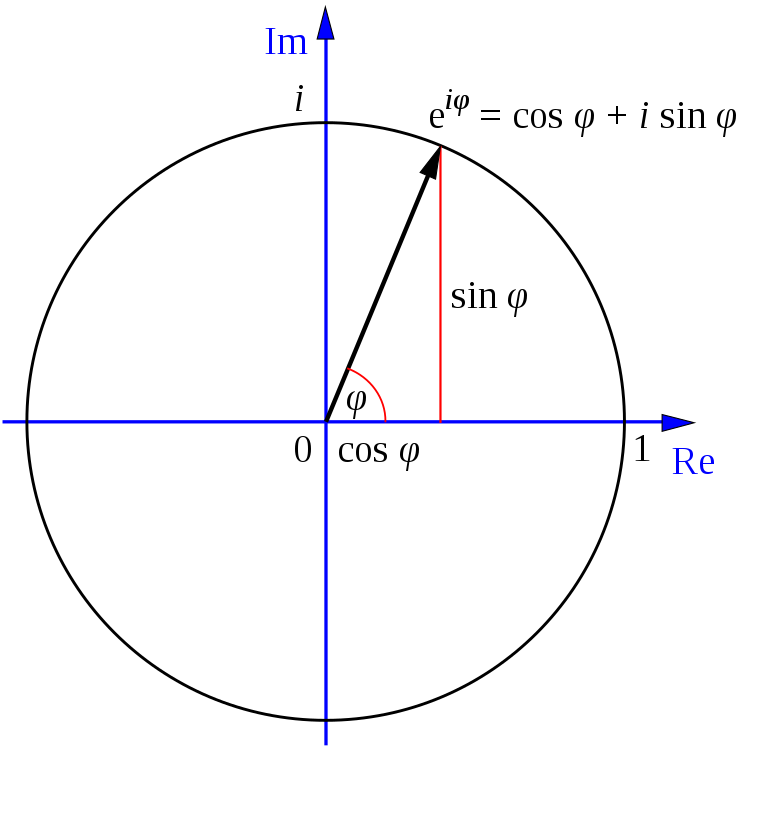

# 2.1 Introduction to quantum mechanics - Quantum bits \(qubits\)

## 量子位元的表示法

一個量子位元可表示如下：

$$
|\psi\rangle=\alpha|0\rangle+\beta|1\rangle,\ \mathrm{with}\ \alpha,\beta\in\mathbb{C}\ \mathrm{and}\ |\alpha|^2+|\beta|^2=1 \ \mathrm{(normalization)}
\tag{2.1}
$$

$$
|0\rangle=\begin{pmatrix}{} 1 \\ 0 \end{pmatrix},\ |1\rangle=\begin{pmatrix}{} 0 \\ 1 \end{pmatrix}\to|\psi\rangle=\begin{pmatrix}{} \alpha \\ \beta \end{pmatrix}
\tag{2.2},\ \mathrm{and}\ |\psi\rangle\in\mathbb{C}^2
$$

複數的表示法為 $$a+bi$$ ，因此如果要定義$$\alpha$$ 與 $$\beta$$ ，照理而言需要4個變數。  
但為滿足 $$|\alpha|^2+|\beta|^2=1$$，且根據 $$\mathrm{Euler's\  Formula:e}^{i\psi}=\cos\psi+i\sin\psi$$ ，所以我們將$$\alpha$$ 與 $$\beta$$ 分別乘以$$\cos\dfrac{\theta}{2}$$ 與 $$\sin\dfrac{\theta}{2}$$ ，將變數減少為 $$3$$ 個，並定義如下：

$$
\alpha=\mathrm{e}^{i\gamma}\cos\dfrac{\theta}{2},\ 
\beta=\mathrm{e}^{i(\gamma+\psi)}\sin\dfrac{\theta}{2}
$$

## 量子態的表示法

接下來，我們來看看 $$|\psi\rangle$$ 是怎麼表示的：

$$
|\psi\rangle
=
\mathrm{e}^{i\gamma}\cos\dfrac{\theta}{2}|0\rangle
+
\mathrm{e}^{i(\gamma+\psi)}\cos\dfrac{\theta}{2}|1\rangle
=
\mathrm{e}^{i\gamma}(\cos\dfrac{\theta}{2}|0\rangle+\mathrm{e}^{i\psi}\sin\dfrac{\theta}{2}|1\rangle)
\tag{2.6}
$$

我們可以發現， $$|\psi\rangle$$ 內部產生了一個共同的因子 $$\mathrm{e}^{i\gamma}$$ ，稱為 $$\mathrm{overall\ (global)\ phase\ factor}$$ 。  
以物理角度而言，這種 $$\mathrm{global\ phase\ factor}$$ 是沒有意義的，只有相對的 $$\mathrm{phase\ factor}$$ ，意即 $$\mathrm{relative\ phase\ factor}$$，才有具意義。

如果就 $$\mathrm{Bloch\ Sphere}$$ 來解釋，$$|\psi\rangle$$ 即為此球面之向量空間。而 $$\mathrm{e}^{i\gamma}$$ 並不影響$$|\psi\rangle$$在此球面上的分布，故以此觀點來看， $$\mathrm{e}^{i\gamma}$$ 便可以忽略不計如下：  
\(思考： $$X軸$$ 與 $$Y軸$$ 組成的複數平面，加上$$|0\rangle$$與$$|1\rangle$$代表的 $$Z軸$$ ，最後形成 $$\mathrm{Bloch\ Sphere}$$。\)

$$
|\psi\rangle
=
\cos\dfrac{\theta}{2}|0\rangle+\mathrm{e}^{i\psi}\sin\dfrac{\theta}{2}|1\rangle
$$

如此一來，一個量子位元可以由 $$2$$ 個實數 $$\theta$$ 與 $$\psi$$ 表示。  
另外，以球面座標而言，$$|\psi\rangle$$ 也可描述為：

$$
\vec{r} = \begin{pmatrix} \cos(\psi)\sin(\phi) & \sin(\psi)\sin(\phi) & \cos(\phi) \end{pmatrix}
\tag{2.7}
$$

